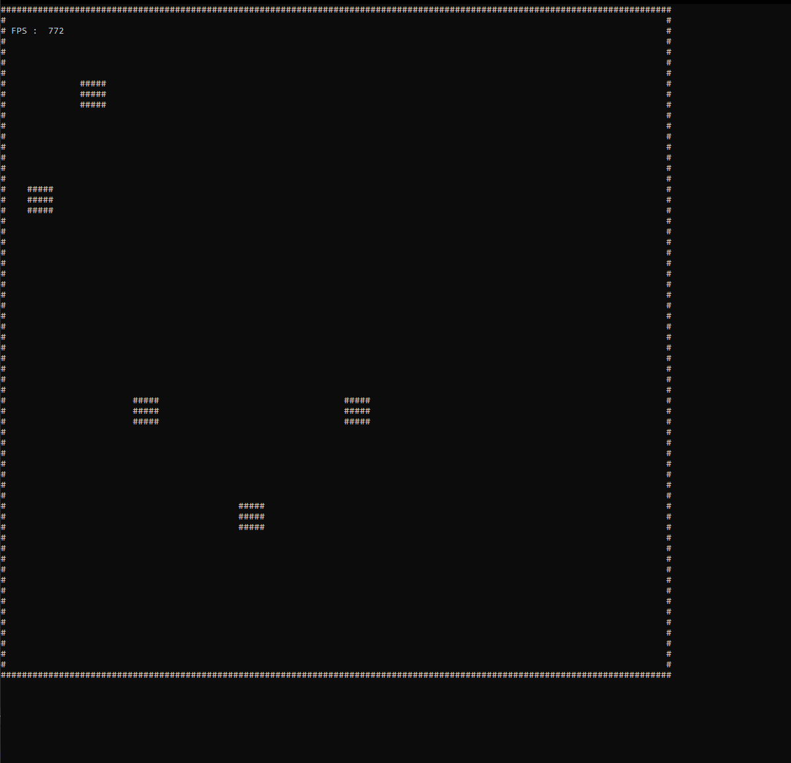

# C++ Console IDLE

This project was planned to be one week task to create Console Game using symbols as pixels.  
Unfortunately Developing this project started to be extremely painfull due to logging to the same console where game was drawn.  
One of the solutions was to use logging to file, however that wouldn't be much better.

## Project goals 

1. Creating memory arena that would store all the objects inside pre-allocated memory for optimization purposes.
2. Using one-dementional array for string storing to pushing it to stdout in one command.
3. Using macros and templates to make Creating of new Resourses easier. (Resource.h)
4. Create Economy system that holds all the resources and values. Potentially accessible on multiple threads 

## Final version

Demo : https://youtu.be/0oGdFLe2GP8

